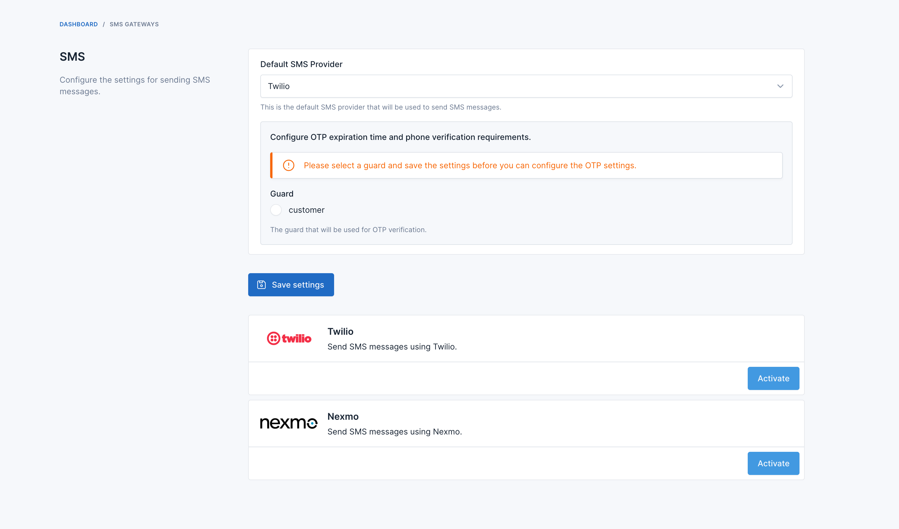
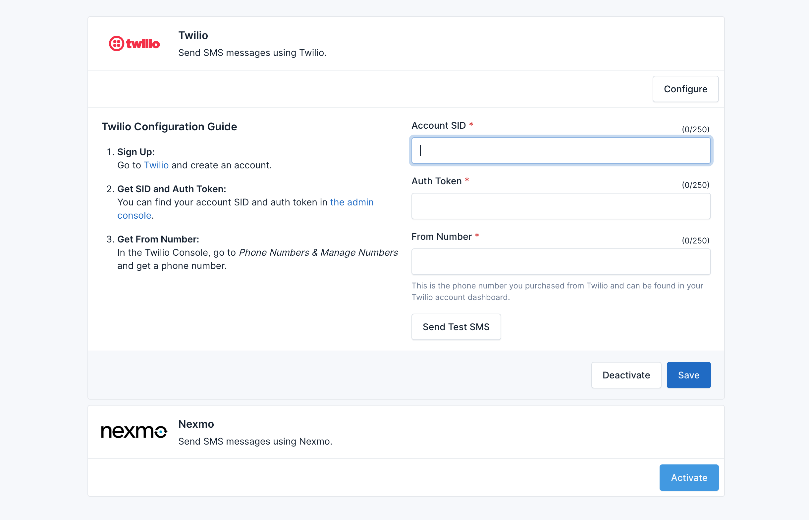
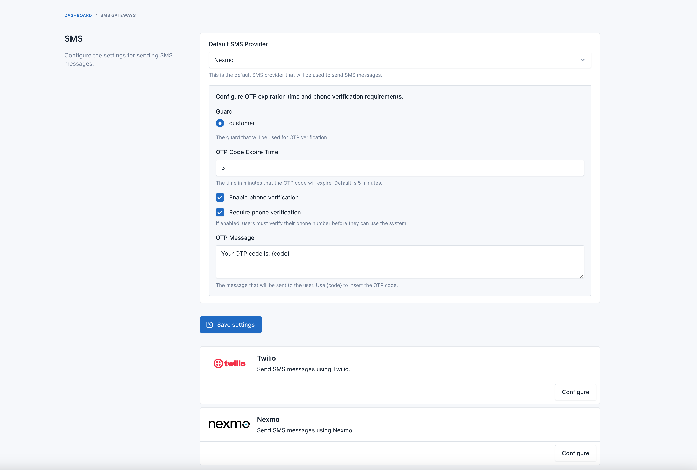

# FOB SMS Gateway

SMS Gateway plugin for [Botble](https://botble.com) is a plugin designed to integrate SMS functionality into your
Botble-based applications. This plugin allows you to send SMS messages to your users, and verify their phone numbers.

## Usage Instructions

1. Go to Admin -> Installed Plugins -> activate the **SMS Gateway** plugin.

2. Then go to **SMS Gateways** to configure the initial settings for the plugin.



3. First, activate the SMS gateway you want to use, enter the secret information of that SMS gateway, and click **Save**.



4. Then, at the top, select the **Default SMS provider** to send SMS.

5. To configure sending OTP for user phone verification, you need to select **guard**. If it is an ecommerce
   application, the guard will be **customer**. Click **Save Settings**.

6. Then check the **Enable phone verification** checkbox to allow users to verify their phone numbers via OTP sent to
   their phone.



## Supported SMS Gateways

The FOB SMS Gateway plugin supports the following SMS gateways:

1. [Twilio](https://www.twilio.com/)
2. [Nexmo](https://www.nexmo.com/)

You can add more SMS gateways by extending the plugin.

## Extending the Plugin

To add a new SMS gateway to the FOB SMS Gateway plugin, follow these steps:

### Create a New Driver Class:

Create a new class that extends `FriendsOfBotble\Sms\Drivers\AbstractDriver` and implement the required methods.

```php
<?php

namespace FriendsOfBotble\Sms\Drivers;

use FriendsOfBotble\Sms\Drivers\AbstractDriver;

class NewDriver extends AbstractDriver
{
    protected function performSend(string $to, string $message): SmsResponse
    {
        // TODO: Implement performSend() method.
    }

    public function getLogo(): string
    {
        // TODO: Implement getLogo() method.
    }

    public function getInstructions(): string
    {
        // TODO: Implement getInstructions() method.
    }

    public function getSettingForm(): FormAbstract
    {
        // TODO: Implement getSettingForm() method.
    }
}
```

### Register the New Driver:

Register the new driver by extending the `FriendsOfBotble\Sms\Facades\Sms`:

```php
use FriendsOfBotble\Sms\Facades\Sms;

Sms::extend('new_driver', function () {
    return new NewDriver();
});
```
